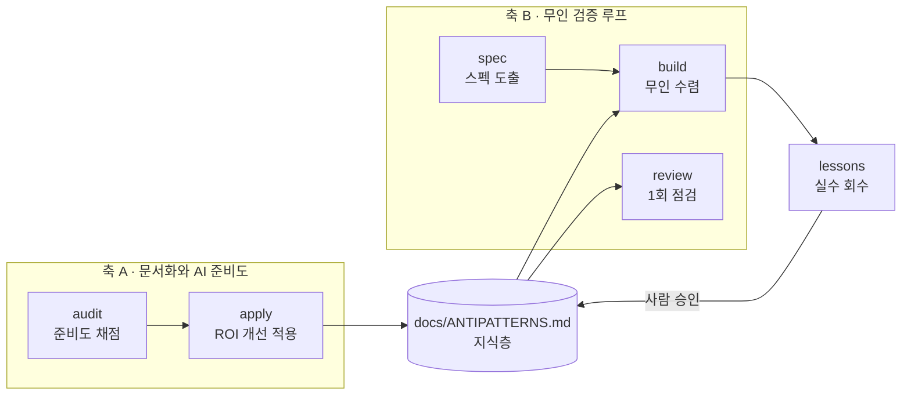
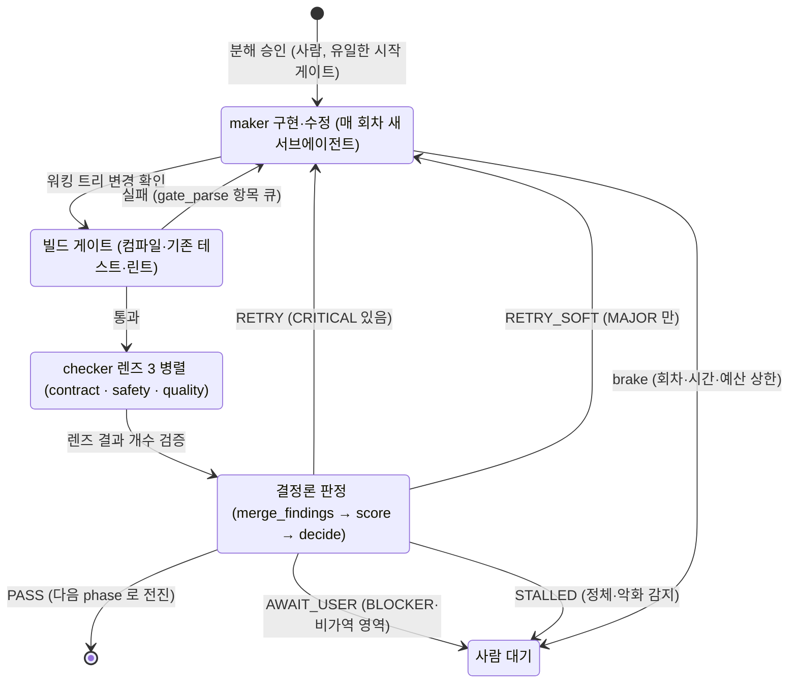

# ai-ready

**코드베이스를 AI 에이전트가 다루기 좋은 상태로 만들고, 그 위에서 코드 변경을 무인으로 검증·빌드아웃하는 Claude Code 플러그인.**

세 가지를 하나의 플러그인으로 묶습니다.

1. **audit** — 코드베이스의 AI 준비도(AI-readiness)를 7개 카테고리 100점 척도로 채점하고 개선 로드맵을 만듭니다.
2. **apply** — 그 감사 결과에서 투자 대비 효과(ROI)가 높은 개선을 실제로 적용합니다.
3. **무인 검증 루프**(spec · build · review · lessons) — 무엇을 만들지부터 스펙으로 확정하고, 코드 변경을 사람이 매 단계 지켜보지 않아도 자동으로 점검·수정·빌드아웃합니다.

`audit → apply → verify` 한 주기를 하나만 설치해서 씁니다.

---

## 한눈에

AI 에이전트(Claude 등)가 낯선 코드베이스에서 잘 일하려면, 사람에게 필요한 것과 같은 것이 필요합니다. 어디에 뭐가 있는지 알려주는 지도, 모듈별 맥락 문서, "이렇게 하지 마라"는 안티패턴, 의존 관계 그림, 검증 장치가 그것입니다. **audit** 은 이 다섯 가지가 얼마나 갖춰졌는지 점수로 측정하고, **apply** 는 부족한 것을 채워 넣습니다. 준비가 되면, **loop 계열** 스킬이 그 위에서 실제 코드 작업을 무인으로 돌립니다.

> **이 문서 읽는 법** — 플러그인이 처음이면 위에서부터 읽으세요. 특정 스킬만 궁금하면 [스킬 6개](#스킬-6개) 로 바로 가세요. 무인 루프(loop 계열)를 볼 거라면 먼저 [알아둘 용어](#먼저-알아둘-용어-loop-계열) 를 훑어두면 뒤가 쉽습니다.

---

## 설치

```
/plugin marketplace add kunsanglee/ai-ready
/plugin install ai-ready@ai-ready
```

## 업데이트

이미 설치했다면 아래를 **각각 한 줄씩** 입력합니다. 슬래시 명령은 한 줄에 하나만 받으므로 주석을 같은 줄에 붙이면 마켓플레이스 이름으로 오해석됩니다.

```
/plugin marketplace update ai-ready
```
```
/plugin update ai-ready@ai-ready
```
```
/plugin list
```

> Claude Code 는 `plugin.json` 의 `version` 필드가 바뀐 경우에만 새 버전으로 인지합니다. 이 저장소는 매 릴리스에 버전을 올립니다. 설치된 버전은 위 `/plugin list` 가, 최신 버전은 [CHANGELOG.md](CHANGELOG.md) 첫 항목이 알려줍니다. 이 문장에 번호를 박아 두면 릴리스마다 갱신을 빠뜨려 어긋납니다 — 실제로 v0.8.8 에서 멈춰 있었습니다.

## 요구사항

로컬 셸과 git 만 있으면 됩니다. 외부 서비스 인증은 필요 없습니다.

- Python **3.10 이상**(감사 스크립트가 `X | None` 유니온 타입 표기를 사용 — 3.9 이하는 import 시점에 문법 오류), `jq`, `bash` 3.2+ (macOS 기본 환경 호환), `git`
- 감사·문서 생성 스크립트는 **표준 라이브러리만** 씁니다(외부 의존성 0).

---

## 무엇을 담고 있나 — 두 축

플러그인은 성격이 다른 두 묶음으로 나뉩니다.

**축 A · 문서화와 AI 준비도** — 코드베이스를 에이전트가 읽기 좋게 만드는 쪽입니다. `audit` 이 진단하고 `apply` 가 처방합니다. 산출물은 사람과 에이전트가 함께 읽는 문서(CLAUDE.md, INDEX.md, ARCHITECTURE.md, ANTIPATTERNS.md 등)입니다.

**축 B · 무인 검증 루프** — 준비된 코드베이스 위에서 실제 코드 변경을 자동으로 검증·수정·빌드아웃하는 쪽입니다. `spec`(무인 실행에 넘길 스펙 도출), `build`(설계를 단계로 쪼개 통과까지 수렴), `review`(1회 점검), `lessons`(실수 회수)로 구성됩니다. 뒤 셋은 같은 판정 엔진(`_loop-engine`)을 공유하고, `spec` 은 그 앞에서 무엇을 향해 돌지를 정합니다.

두 축은 한 지점에서 만납니다. audit 이 만드는 `docs/ANTIPATTERNS.md` 가 loop 계열의 **지식층**이 됩니다. 루프가 점검할 때 이 문서를 읽고, `lessons` 가 새로 잡은 실수를 여기에 덧붙입니다.



audit 이 채운 지식층을 루프가 점검 기준으로 읽고, 루프가 잡은 실수가 사람 승인을 거쳐 다시 지식층으로 돌아옵니다. 이 순환이 플러그인 전체의 뼈대입니다.

---

## 먼저 알아둘 용어 (loop 계열)

무인 루프 설명에 반복해 나오는 말들입니다. 여기만 훑어두면 뒤가 술술 읽힙니다.

| 용어 | 뜻 |
|---|---|
| **maker** | 실제로 코드를 작성·수정하는 주체. 전용 `loop-maker` 서브에이전트가 맡습니다(기본 모델 opus·effort high, 모델은 호출 시 조정 가능). **매 회차 새로 띄웁니다** — 회차 사이에 넘길 것은 대화가 아니라 워킹 트리에 있습니다. |
| **checker** | maker 가 고친 코드를 독립된 시각으로 점검하는 주체. 결함의 종류와 위치만 태깅합니다. 매번 새로 띄웁니다. 모델은 세션을 상속하지만 effort 는 `xhigh` 로 고정합니다 — 만드는 쪽은 싸게, 판정하는 쪽은 비싸게가 이 루프의 전제입니다. |
| **렌즈** | checker 한 명이 맡는 점검 축. `build` 는 checker 를 `contract`·`safety`·`quality` 셋으로 갈라 **서로를 모른 채 동시에** 띄웁니다. 한 명이 여섯 차원을 순회하면 각 차원에 쓸 탐색량이 나뉘고, 먼저 선 판단에 나머지가 끌려가기 때문입니다. |
| **오케스트레이터** | 직접 코딩하지 않고 순서를 관리하는 조율자. 당신이 명령을 친 메인 세션이 이 역할입니다. |
| **서브에이전트** | 메인 세션이 따로 띄우는 독립 작업 에이전트. 자기만의 대화 맥락을 가져서, 여기서 한 작업이 메인 맥락을 어지럽히지 않습니다. |
| **rubric(루브릭)** | "무엇을 통과로 볼지"와 "언제 멈출지(회차·시간·예산 상한)"를 적어둔 채점 규칙표. LLM 주관이 아니라 이 규칙대로 기계적으로 판정합니다. |
| **severity(심각도)** | checker 가 찾은 결함의 등급. 심한 순으로 `BLOCKER` · `CRITICAL` · `MAJOR` · `MINOR`. 통과 조건은 "BLOCKER 0개 그리고 CRITICAL 0개". |
| **게이트** | 통과해야 다음으로 넘어가는 관문. 시작 게이트(사람 승인), 빌드 게이트(컴파일·기존 테스트), 종료 게이트(severity 판정) 셋이 나옵니다. |
| **brake(브레이크)** | 무인 실행이 무한정 돌지 않게 강제로 멈추는 안전 상한. 회차·시간을 다 쓰면 걸려 사람을 부릅니다. |
| **phase / step** | phase 는 설계를 독립적으로 개발·검증할 수 있는 큰 덩어리, step 은 그 안의 세부 작업. `build` 가 일을 이 단위로 쪼갭니다. |
| **워크트리** | 이 작업만을 위한 격리된 작업 폴더(git worktree). 변경이 여기 쌓이고 커밋 전까지 메인 브랜치를 건드리지 않습니다. |

> **왜 고치는 쪽(maker)과 점검하는 쪽(checker)을 나누나?** 자기가 짠 코드를 자기가 검토하면 결함을 놓칩니다. 글쓴이가 자기 글의 오탈자를 잘 못 잡는 것과 같습니다. 그래서 쓴 사람과 교정 보는 사람을 나누고, 교정자는 매번 선입견 없는 새 눈으로 바꿉니다.

---

## 스킬 6개

### `audit` — AI 준비도 채점 + 개선 로드맵

코드베이스가 AI 에이전트에게 얼마나 친화적인지 7개 카테고리로 채점하고, 무엇부터 고칠지 우선순위를 매긴 리포트와 대시보드를 만듭니다.

- **트리거** — `/ai-ready:audit`, "AI 준비도", "코드베이스 감사", "score my codebase for AI agents", "모듈별 CLAUDE.md 생성"
- **입력** — 대상 코드베이스 경로. 선택으로 스캐폴드할 상위 모듈 수(기본 5개), 안티패턴을 캐낼 git 이력 기간(기본 180일).
- **산출물** — 대상의 `.ai-ready/` 아래에 생성합니다.
  - `audit.json` — 카테고리·규칙별 원시 점수와 근거
  - `audit-report.md` — ROI 우선순위 개선 액션 목록(사람이 읽는 로드맵)
  - `dashboard.html` — 게이지·카테고리 막대·점수 추이 스파크라인을 담은 자체완결 대시보드
  - `history/{시각}.json` — 실행 이력(추이 렌더용, 삭제 금지)
  - `scaffolds/` — 누락 문서 초안(모듈별 CLAUDE.md 등)과 git 이력에서 추출한 `ANTIPATTERNS.md` 시드
  - `hooks/freshness_check.sh` + `freshness_check.py` — 문서 신선도 점검 훅(자기완결 복사본)
  - `README.md` — 산출물 소비 가이드(무엇부터 읽고 어디에 옮기는지)
- **평가 카테고리 (7개, 총 100점)**

  | # | 카테고리 | 무엇을 보나 |
  |---|---|---|
  | 1 | 내비게이션 | 루트에서 모듈까지 찾아가는 경로·문서 참조 |
  | 2 | 컨텍스트 문서 품질 | CLAUDE.md 와 문서의 내용 충실도 |
  | 3 | 암묵지 & 안티패턴 | ANTIPATTERNS.md, git 핫스팟에서 드러나는 함정 |
  | 4 | 모듈 간 의존성 추적 | ARCHITECTURE.md, 의존 그래프 |
  | 5 | 검증 게이트 | CI 훅, 테스트, 린트 같은 기계적 검증 장치 |
  | 6 | 신선도 자동 유지 | 문서가 코드와 함께 갱신되게 하는 장치 |
  | 7 | 성과 지표 | 결과 측정·추적 인프라 |

- **점수 등급**

  | 등급 | 점수 | 상태 |
  |---|---|---|
  | AI-blind | 0–39 | 에이전트가 컨벤션·경계 없이 헤맴. 매 PR마다 같은 맥락을 다시 설명 |
  | AI-aware | 40–59 | 일부 가이드 존재. 핫 모듈에만 도움 |
  | AI-enabled | 60–79 | 모듈 가이드·안티패턴·의존 그래프를 갖춰 에이전트가 자율 작업 가능 |
  | AI-maximalist | 80–89 | 신선도 자동 갱신 + 측정 인프라 운영 |
  | Agentic-ready | 90–100 | 다중 에이전트가 자율적으로 PR 을 만들 수 있는 상태 |

- 멀티모듈과 단일모듈(패키지=논리 모듈) 레이아웃을 자동 감지해 채점 규칙과 스캐폴드 출력을 달리합니다.
- 대상에 `.ai-ready/config.json` 을 두면(선택) frontmatter 인식 INDEX 그룹화·lazy-load 트리거 보존·프로젝트 현실을 반영한 채점(통합 design 디렉터리를 ADR 로 인정 등)을 활성화합니다. 없으면 기본 동작 그대로입니다.

### `apply` — 감사 결과를 실제로 적용

`audit.json` 과 `audit-report.md` 를 읽어, ROI 상위 개선 액션을 차례로 실행합니다.

- **트리거** — `/ai-ready:apply`, "audit 적용", "ROI 액션 실행", "우선순위 액션 적용"
- **입력** — 대상 디렉터리(이미 `audit.json` 이 있어야 함).
- **처리 방식** — 각 액션을 성격에 따라 넷 중 하나로 다룹니다.
  - **maintain(외과적 유지보수)** — 스크립트가 사실만 모으고(`--json` 읽기 전용), AI 가 현재 문서를 읽어 **새 항목만 추가하고 바뀐 것만 고칩니다.** 사람이 손댄 그룹·순서·산문은 보존합니다. 통째 덮어쓰기를 하지 않습니다.
  - **judgment** — AI 가 초안을 쓰고 사용자가 승인합니다(안티패턴 항목, ADR, "DO NOT" 섹션 등).
  - **mechanical** — 멱등 스크립트를 실행합니다(모듈 CLAUDE.md 스캐폴드, ARCHITECTURE.md 다이어그램, 신선도 훅 설치 등).
  - **skip** — 이미 충족된 항목.
- **사람이 인수한 문서 보호** — 생성 대상 파일에 자동 생성 서명이 없으면(사람이 직접 다듬은 문서라는 뜻) 덮어쓰기를 거부하고 멈춥니다. `--force` 로만 우회하며, 적용은 문서별 diff 확인 루프를 거쳐 승인분만 반영합니다.

#### 만들어지는 문서들이 각각 무엇을 하나

축 A 의 산출물이 곧 제품입니다. 점수는 이 문서들이 갖춰졌는지의 측정일 뿐이고, 에이전트가 실제로 읽고 일하는 것은 아래 문서들입니다. audit 이 초안(scaffold)을 만들고, 사람이 검수해 확정하며, apply 가 이후의 갱신을 외과적으로 유지보수합니다.

| 문서 | 역할 | 없으면 생기는 일 |
|---|---|---|
| 모듈별 `CLAUDE.md` | 에이전트가 그 모듈을 만질 때 자동으로 읽는 맥락 문서. 핵심 파일·불변식·흐름·테스트 위치를 담습니다. 단일모듈 레이아웃에서는 패키지 카탈로그 `docs/PACKAGES.md` 하나로 대신합니다 | 세션마다 같은 도메인 설명을 사람이 다시 타이핑합니다 |
| `AGENTS.md` 심링크 | 같은 내용을 Codex 등 다른 에이전트 규약의 파일명으로도 읽게 하는 브리지. 내용을 복제하지 않아 두 벌이 갈리지 않습니다 | 도구마다 다른 문서를 읽어 기준이 갈립니다 |
| `INDEX.md` | 루트에서 도메인·모듈로 찾아가는 저장소 지도. 에이전트의 첫 진입점이라, 전체를 훑지 않고 필요한 곳만 열게 합니다 | 매 작업이 저장소 전체 탐색으로 시작해 느리고 비쌉니다 |
| `ANTIPATTERNS.md` | "하지 말 것"과 그 이유. git 이력의 반복 수정·revert 핫스팟에서 시드를 캐고, 이후 `lessons` 가 루프가 잡은 실수를 덧붙입니다. **두 축이 만나는 지식층**이라 checker 가 매 실행 이 문서를 판단 기준으로 읽습니다 | 같은 실수가 사람과 에이전트에게서 반복됩니다 |
| `ARCHITECTURE.md` | 모듈 의존 그래프(mermaid). 경계를 넘는 변경의 영향 범위를 코드를 다 읽기 전에 가늠하게 합니다 | 영향 범위 판단이 매번 전체 grep 이 됩니다 |
| 신선도 훅 | 코드가 바뀌었는데 위 문서들이 안 바뀌면 세션 종료 시점에 알립니다. 문서가 조용히 낡는 것을 막는 장치입니다 | 문서가 코드와 어긋난 채 계속 읽혀, 틀린 맥락이 판단을 오염시킵니다 |

핵심 원칙은 하나입니다. **자동 생성물은 초안이고, 도메인 정확성은 사람이 검수해 확정합니다.** 그래서 apply 는 사람이 다듬은 문서를 통째로 덮어쓰지 않고 새 항목 추가와 변경분 수정만 합니다.

### `spec` — 무인 루프에 넘길 스펙 도출

`build` 는 스펙이 이미 있다고 보고 phase 로 쪼갭니다. 이 스킬은 그 앞에 서서 **스펙 자체를 만듭니다.** 아직 아무도 정하지 않은 결정을 `loop-spec-checker` 가 다섯 렌즈로 열거하면, 그것을 넷 중 하나로 처분합니다 — 코드나 컨벤션 문서에 답이 있으면 그 경로와 함께 닫고, 나중에 감으로 맞출 조절값은 기본값을 두고, 추측일 수밖에 없는 것만 사람에게 묻고, "나중에" 라는 답은 미결로 남겨 산출 문서가 들고 갑니다.

- **트리거** — `/spec [초안·설계문서 경로]`, "스펙 뽑자", "요구사항 정리", "루프 돌리기 전에 스펙부터"
- **입력** — 초안 문서(선택), 대화에서 이미 합의된 것, 그리고 기존 코드와 컨벤션 문서.
- **산출물** — `.loop/spec/{slug}/spec.md`(그대로 `/build` 에 넘깁니다)와 `decisions.json`(결정 원장 — 나중에 "왜 이렇게 정했나" 를 되짚는 유일한 근거).
- **종료 조건이 통과가 아니라 미결 0 이고, 그 판정을 모델이 아니라 셸이 합니다.** 스펙의 구멍은 대부분 사람 머릿속에만 있어서, "지적받았으니 보완해라" 를 시키면 작성하는 쪽이 그럴듯한 답을 채우고 다음 회차의 점검이 "이제 정해졌네" 하고 통과시킵니다. **게이트는 초록인데 사람 의도와 무관한 스펙이 나오는 환각 수렴기**가 되는 자리라, 모든 결정에 처분과 근거를 함께 요구하고 근거 없이 닫힌 항목은 `exit 65` 로 거부합니다.
- **도출과 질문은 메인 세션이 합니다.** 서브에이전트는 사람에게 직접 못 물어 왕복이 성립하지 않습니다. 열거만 `loop-spec-checker` 에 내리고 나머지는 이 스킬 본문이 진행합니다. 그리고 그 점검기를 못 부르면 **다른 에이전트로 대신 돌리지 않고 멈춥니다** — 열거가 이 층의 전부인데 누가 했는지가 실행마다 달라지면 같은 스펙이 회차마다 다른 개수의 결정을 내고 무엇이 빠졌는지 아무도 설명하지 못합니다. 원장이 남아 있어 세션을 다시 시작해도 답한 것을 다시 묻지 않습니다.

### `build` — 설계를 사람 없이 구현해 수렴

확정된 설계나 작업 지시를 phase/step 으로 쪼개 사람이 한 번 승인하면, 그 뒤로는 phase 마다 `maker`(고치기) → `checker`(독립 점검) → 결정론 채점 → 정체 판정을 통과 기준을 만족할 때까지 반복하고 다음 phase 로 전진합니다. 코드를 실제로 고칩니다. **변경 하나만 수렴시키는 것도 이 스킬입니다** — phase 가 하나인 경우일 뿐입니다.

- **트리거** — `/build [phase당 회차] [설계 문서 경로]`, "루프 돌려", "설계대로 쭉 빌드해", "이 작업 루프로 수렴시켜"
- **입력** — 설계 문서/작업 지시 경로(형식 무관, 오케스트레이터가 phase 로 분해), phase 당 회차(선택, 기본 5회·하드 천장 10회), 비교 베이스(기본 `origin/main`). 인자는 타입으로 구분해 순서가 바뀌어도 안전합니다. 합의가 대화에만 있으면 오케스트레이터가 분해안을 적어 사람에게 확인받은 뒤 시작합니다 — 무인 실행에서 사람이 거치는 유일한 관문입니다.
- 그 확인과 **같은 화면**에서 `loop-spec-checker` 가 그 스펙이 답하지 않은 결정을 열거합니다. 사람이 아직 있는 마지막 순간이라 여기서 답하면 되고, **시작을 막지는 않습니다** — 무엇이 결정적인지는 프로젝트마다 다르고, 기계가 막으면 사람이 우회법부터 배웁니다.
- **동작** — Step 0 셋업 → Step 1 분해 → **착수 전 스펙 검사**(기계) → **스펙 완전성 점검**(`loop-spec-checker`) → **사람 승인(유일한 시작 게이트)** → Step 1-1 순회를 서브에이전트에 위임 → Step 2 phase 순회(빌드 게이트 → checker 렌즈 셋 병렬 → 병합·채점 → 분기) → Step 3 완료 보고.
- **산출물** — 수렴된 변경(워크트리에 쌓이고 커밋은 하지 않음) + phase 별 사이클 로그(`.loop/run/{ticket}/history-{phase}.jsonl`).
- **핵심 성질**
  - 착수 전 스펙 검사(`exit_criteria`·`irreversible`·`non_goals`·`tiebreaks`)를 **통과해야 시작합니다**. 못 통과하면 다른 방식으로 도는 것이 아니라 분해를 고쳐 다시 옵니다 — 검사 옆에 우회로가 있으면 그 검사는 권고가 됩니다.
  - `non_goals` 는 그 phase 가 **안 볼 표면**입니다. 적어 두면 그것을 구현한 것이 `intent-nongoal-violation`(BLOCKER)으로 잡히고, checker 렌즈가 finding 마다 범위 안팎을 표시해 회차 요약에 `out_of_scope` 로 집계됩니다. **그 집계는 등급을 바꾸지 않습니다** — 회차를 다 쓰고 멈춘 자리에서 사람이 "이 지적이 이번 목표 안인가" 를 파일로 볼 수 있게 하는 계측입니다.
  - 순회는 **언제나 서브에이전트에 내립니다**. 사이클 잡음(채점 결과·maker 지시·게이트 출력)이 사람이 보는 창에 안 쌓이고, 메인에는 phase 가 하나 닫힐 때마다 한 줄이 올라옵니다.
  - maker 는 **매 회차 새로 띄우는** 서브에이전트이고 **오케스트레이터 세션은 코드를 쓰지 않습니다**. 회차를 건너 전달되는 것은 대화가 아니라 워킹 트리와 반복 표시(이력에서 뽑는 finding 단위 반복 횟수)입니다. 게이트를 돌리기 전에 트리가 실제로 바뀌었는지 확인합니다 — 보고는 틀릴 수 있어도 트리는 그럴 수 없습니다.
  - checker 는 축이 갈린 렌즈 셋으로 **병렬**로 돌고, 결과는 **개수를 세어** 합칩니다. 렌즈 하나가 죽어도 남은 것의 형식은 멀쩡해서, 세지 않으면 그 축이 한 번도 점검되지 않은 채 통과합니다.
  - 회차·시간·예산 상한을 **phase 하나 기준**으로 봅니다. 전체 시간 상한은 `phase당 120분 × phase수` 로 자동 확장돼, phase 가 늘어도 뒤 phase 가 시간에 잘리지 않습니다.
  - 빌드·테스트·린트 명령, 티켓 패턴, 베이스 브랜치는 `detect_build.py` 가 런타임에 감지해 어댑터 파일을 남기지 않습니다.
  - 게이트가 깨지면 그 출력은 창이 아니라 파일로 가고, `gate_parse.py` 가 항목 큐(`.loop/run/{ticket}/gate-queue.jsonl`)로 바꿉니다. maker 는 컴파일 오류 → 테스트 실패 → 린트 위반 순으로 항목을 꺼내 고칩니다.
  - 무인 순회를 시작·재개하기 직전 분해 결과(`phases.json`)가 온전한지 검증하고, 손상됐으면 즉시 멈춰 사람을 부릅니다.
  - 구현이 설계와 어긋나야 한다고 판단되면 임의로 설계를 바꾸지 않고 멈춰 사람에게 재결정을 맡깁니다. 목표는 "설계대로 구현"이지 "설계를 고쳐 구현"이 아닙니다.

### `review` — 1회 점검·보고 (코드는 안 고침)

무인 루프와 같은 판정 엔진으로 현재 변경을 **한 번만** 점검해 등급순 리포트를 냅니다. 고치는 건 사람이 합니다.

- **트리거** — `/review [--html]`, "loop 리뷰", "이 변경 점검"
- **입력** — 현재 브랜치 변경(기본 `origin/main..HEAD` + 커밋 전 변경), 작업 정의(선택).
- **산출물** — 마크다운 리포트(기본) 또는 `--html` 로 자체완결 HTML. 등급별(BLOCKER→CRITICAL→MAJOR→MINOR) finding 과 판정 요약.
- checker 를 한 명만 띄워 여섯 차원을 다 보게 합니다. 축을 갈라 병렬로 띄우는 것은 `build` 쪽이고, 1회 점검은 사람이 읽을 보고서 하나로 떨어지는 편이 낫습니다.
- 빌드·테스트를 돌리지 않고 점검만 하므로 빠릅니다.

### `lessons` — 잡은 실수를 재발 방지 지식으로

루프가 끝난 뒤, 잡힌 실수와 사람·PR 지적을 모아 `docs/ANTIPATTERNS.md` 후보 초안을 만들고, **사람이 하나씩 승인**해서 반영합니다.

- **트리거** — `/lessons [--history <경로>]`, "lesson 종합", "안티패턴 후보"
- **입력** — 루프 이력(phase 별 `history-{phase}.jsonl`, 자동), 선택으로 사람·PR 지적, 티켓 요약.
- **산출물** — `docs/ANTIPATTERNS.md` 에 승인 항목 추가(통째 덮어쓰기 없음), 필요 시 프로젝트 LOCAL 루브릭에 예외 한 줄 추가.
- **수록 문턱** — 같은 자리 수정이 3회 이상 반복되거나 revert 가 난 것만 올립니다. 일회성 국소 실수는 버립니다. 무인 루프여도 이 반영 단계만은 반드시 사람 승인을 거칩니다.

### 언제 무엇을 쓰나

| 상황 | 스킬 |
|---|---|
| 코드베이스가 AI 에게 얼마나 준비됐는지 점수·로드맵을 보고 싶다 | `audit` |
| 그 로드맵의 개선을 실제로 적용하고 싶다 | `apply` |
| 루프에 넘길 스펙이 아직 없다. 미결정부터 열거해 닫고 싶다 | `spec` |
| 변경 **하나**를, 또는 **설계 전체**를 통과까지 무인으로 수렴시키고 싶다 | `build` |
| 지금 변경을 고치지 않고 **한 번** 점검만 받고 싶다 | `review` |
| 루프가 잡은 실수를 재발 방지 지식으로 정리하고 싶다 | `lessons` |

---

## 판정 엔진은 어떻게 판단하나 (`_loop-engine`)

loop 계열 셋은 같은 결정론 판정 엔진을 공유합니다. 핵심은 **"등급을 LLM 이 매기지 않는다"** 입니다.

**checker(LLM)는 결함의 종류와 위치만 찾고, 등급은 규칙표를 보고 셸이 매깁니다.** LLM 이 등급을 매기면 같은 코드에도 실행마다 판정이 흔들려 통과 여부가 불안정해집니다. 종류·위치만 LLM 이 태깅하고 심각도는 결정론 셸이 매기면, 같은 코드엔 항상 같은 등급이 나옵니다.

- **checker 의 6개 점검 차원** — `compatibility`(하위 호환), `security`(권한·입력 검증), `runtime`(동시성·트랜잭션·N+1·멱등성 등), `intent`(작업 정의 ↔ 코드 정합), `convention`(네이밍·컨벤션·테스트 누락), `simplicity`(더 적은 코드로 같은 일이 되는가).
- **렌즈 셋으로 갈라 병렬 점검** — `build` 는 이 여섯을 `contract`(compatibility+intent)·`safety`(security+runtime)·`quality`(convention+simplicity) 셋으로 나눠 서로 모르는 checker 셋에 맡깁니다. 각자 자기 파일에만 쓰고, `merge_findings.sh` 가 **결과 개수를 세어** 하나로 합칩니다 — 기대한 수가 안 오면 남은 것만으로 채점하지 않고 멈춥니다. 안 돈 축은 점검된 적이 없고, 그걸 통과로 읽으면 그 차원의 결함이 영영 안 잡히기 때문입니다.
- **`simplicity` 는 두 규율 아래에서만 작동합니다** — 더 단순한 등가 대안을 구체적으로 제시할 수 있을 때만 지적하고, 총량이 아니라 이번 변경이 새로 더한 것만 봅니다. 그러지 않으면 루프가 취향 논쟁으로 회차를 태웁니다.
- **severity 4단계와 행동**

  | 등급 | 행동 | 뜻 |
  |---|---|---|
  | BLOCKER | 사람 대기(AWAIT_USER) | maker 가 못 고치거나 고치면 안 됨. 비가역·자동화 금지 |
  | CRITICAL | 재시도(RETRY) | 진짜 결함이나 maker 가 고칠 수 있음 |
  | MAJOR | 계속 개선(RETRY_SOFT) | 고치면 좋으나 통과 가능. 정체 시 사람 승인으로 통과 |
  | MINOR | 통과(기록만) | 사소 |

- **통과는 점수 합산이 아니라 게이트** — 사소한 결함이 10개라도 심각한 게 없으면 통과, 단 하나라도 BLOCKER 면 불통과입니다. "총점 평균"이 아니라 "가장 심각한 게 무엇이냐"로 문을 엽니다.

한 phase 안의 회차는 아래 상태 기계를 돕니다. 전이 라벨은 `decide.sh` 가 내는 verdict 이름 그대로라, 이 그림과 엔진의 어휘가 어긋날 자리가 없습니다.



사람이 개입하는 문은 둘뿐입니다. 시작할 때의 분해 승인, 그리고 `Await` 로 빠졌을 때입니다. 나머지 전이는 전부 결정론 셸이 정합니다.
- **비가역 영역은 등급과 무관하게 사람 대기** — 운영 DB 변경, 돈·정산, 인가 정책, 대량 발송, 삭제·탈퇴는 점수가 만점이어도 멈춰 사람을 부릅니다.
- **상한 기본값(단일 원천)** — 회차 5(천장 10), 시간 120분, 비용 $500, 토큰 5M. 정체·악화 감지 파라미터도 같은 표에 있습니다.
- **BASE + LOCAL 루브릭** — 프로젝트 무관 골격은 `_loop-engine/rubric.base.md`(BASE)에, 프로젝트 특유 규칙은 대상의 `.loop/rubric.md`(LOCAL)에 둡니다. 둘은 병합되며 같은 항목은 LOCAL 이 우선합니다.

엔진을 이루는 조각은 이렇습니다.

| 파일 | 책임 |
|---|---|
| `merge_findings.sh` | 렌즈별 checker 결과를 개수를 세어 하나로 합침. 기대한 수가 안 오면 채점하지 않고 멈춤 |
| `score.sh` | checker 가 낸 결함마다 규칙표로 severity 를 매김 |
| `decide.sh` | 매겨진 결함을 모아 판정(PASS/RETRY/AWAIT_USER 등)을 냄 |
| `stall.sh` | 회차 간 정체·악화를 감지 |
| `lessons.sh` | 루프 이력에서 "고쳐진 실수"를 추출(`lessons` 입력) |
| `detect_build.py` | 매니페스트·브랜치를 읽어 빌드·테스트·린트 명령, 티켓 패턴, 베이스 브랜치, 컨벤션 문서를 런타임 감지 |
| `gate_parse.py` | 게이트(빌드·테스트·린트) 실패 출력을 한 줄 하나의 JSON 항목으로 바꿈. maker 가 항목 단위로 꺼내 고친다 |
| `rubric.base.md` | BASE 루브릭(사람이 읽고 편집하는 규칙 데이터) |
| `test.sh` | 채점 로직의 결정론 회귀 테스트 |

세 에이전트가 루프의 각 시점을 맡습니다. **`loop-spec-checker`** 는 루프가 **돌기 전에** 그 지시가 답하지 않은 결정을 다섯 렌즈로 열거합니다(`/spec` 의 주 도구이고, `/build` 도 승인 화면 앞에서 한 번 부릅니다). **`loop-checker`** 는 **도는 동안** 위 6개 차원으로 변경을 적대적으로 점검해 구조화 결과를 냅니다. **`loop-lesson-synthesizer`** 는 **끝난 뒤** 실수를 안티패턴 후보로 정리합니다. 셋 다 **코드를 수정하지 않습니다**(읽기 전용) — 그 계약은 산문이 아니라 각 정의의 `tools` 줄이 강제하고, 시험이 그 줄을 셉니다.

> 에이전트 이름에는 `loop-` 접두가 남아 있습니다. 스킬과 달리 에이전트 이름은 사람이 타이핑하지 않고, `maker`·`checker` 같은 일반명은 다른 플러그인과 부딪히기 쉬워서입니다.

---

## 설계 원칙

- **심각도는 결정론 셸이 매긴다** — 같은 코드엔 같은 등급. 판정의 재현성을 보장합니다.
- **문서는 AI 가 외과적으로 유지보수한다** — 사실은 스크립트가 모으고, 새 항목 추가와 변경분 수정만 AI 가 하며, 사람이 손댄 큐레이션은 보존합니다.
- **maker 와 checker 를 분리한다** — checker 는 코드를 수정하지 않고 maker 의 변명을 듣지 않습니다. 독립성이 신뢰의 근거입니다.
- **fail-loud** — 비었거나 형식이 어긋난 입력을 조용히 통과시키지 않고 즉시 멈춥니다. `build` 는 무인 순회 직전 `phases.json` 을, 채점 직전 렌즈 결과 개수를 이렇게 검증합니다.
- **사람 승인을 의무화한다** — apply 의 매 액션, `lessons` 의 모든 반영, `build` 의 분해 승인이 사람 게이트입니다.
- **비가역 영역은 사람이 판단한다** — 운영 DB·돈·인가·대량 발송·삭제는 자동화하지 않습니다.

---

## 저장소 구조

```
.
├── .claude-plugin/marketplace.json   # 마켓플레이스 manifest
└── plugins/
    └── ai-ready/
        ├── .claude-plugin/plugin.json
        ├── skills/
        │   ├── audit/         # AI 준비도 채점 + 리포트·대시보드·시드 생성
        │   ├── apply/         # ROI 액션 적용 (외과적 문서 유지보수)
        │   ├── spec/          # 무인 루프에 넘길 스펙 도출 (미결 0 까지)
        │   ├── build/         # 설계를 phase 로 쪼개 통과까지 무인 수렴
        │   ├── review/        # 1회 점검·보고
        │   └── lessons/       # 잡은 실수 → 지식층 반영 (사람 승인)
        ├── agents/            # loop-maker · loop-spec-checker · loop-checker · loop-lesson-synthesizer
        ├── _loop-engine/      # 결정론 채점 셸 + 렌즈 병합 + BASE 루브릭 + detect_build.py + gate_parse.py
        └── tests/             # 회귀 시험 (stdlib unittest — audit 스크립트 · 스킬 문서 셸 블록 · 에이전트 정의)
```

시험은 세 층입니다. `_loop-engine/test.sh` 가 채점 결정론을, `tests/test_agent_defs.py` 가 에이전트 정의를(읽기 전용 계약이 `tools` 줄에서 새지 않는지, 그리고 그 정의가 매니페스트에 등록돼 실제로 로드되는지), `tests/test_skill_blocks.py` 가 스킬 문서 안 셸 블록을 지킵니다. 뒤쪽은 SKILL.md 에서 블록을 뽑아 격리 레포에서 **프레시 셸마다** 실제로 돌립니다. 오케스트레이터가 그 블록을 그대로 Bash 도구에 넣어 실행하므로 블록이 곧 코드이고, 문법 검사로는 프레시 셸에서 변수가 복원되는지·fail-loud 경로가 실제로 멈추는지·지운다고 말한 것이 지워지는지를 알 수 없습니다. `tests/mutate_skill_blocks.py` 는 그 시험에 이가 있는지를 봅니다 — 지난 릴리스에서 실제로 있었던 결함을 문서 사본에 되넣고 시험이 깨지는지 확인합니다. 초록 50건은 "결함이 없다" 와 "결함을 볼 눈이 없다" 를 구별하지 못하기 때문입니다.

---

릴리스마다 무엇이 왜 바뀌었는지는 [CHANGELOG.md](CHANGELOG.md) 에 있습니다.

---

## 라이선스

MIT
